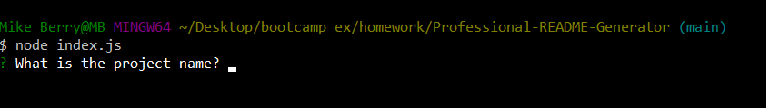

# <professional-readme-generator>

## Description

This project aimed to create a command line application that could generate a professional README file after prompting the user with questions. When the application is run from the command line via the command node index.js, the user is prompted to answer a variety of questions about their project. Once the questions have been answered a professionally formatted README is generated with thier responses.

This project highlighted the use of node.js to write start writing backend code using JS as the entire application is run via the command line. The inquirer package was used to create the question prompts and make the object where the answers were stored. A template literal was used to format the README and easily add the answers to the file.

## Usage

As this project was not deployed, the repo of the project can be found at https://github.com/mgberrysd/Professional-README-Generator

When run on the command line the user should see the following:

A video of the application being run can be found at https://drive.google.com/file/d/1mgxvi4UDHekJcSXf8pPlFyIGplHQ4j7A/view

## Credits

The JS for the Professional README Generator was created by Michael Berry.

The project used the node Inquirer package for the command line prompts.